**操作系统原理 实验一**

## 实验题目

编译内核/利用已有内核构建OS  

## 实验目的

1. 熟悉现有Linux内核的编译过程和启动过程， 并在自行编译内核的基础上构建简单应用并启动。
2. 利用精简的Busybox工具集构建简单的OS， 熟悉现代操作系统的构建过程。
3. 熟悉编译环境、相关工具集，并能够实现内核远程调试。

## 实验要求

1. 搭建 OS 内核开发环境包括：代码编辑环境、编译环境、运行环境、调试环境等。
2. 下载并编译 i386（32位）内核，并利用 qemu 启动内核。
3. 熟悉制作 initramfs 的方法。
4. 编写简单应用程序随内核启动运行。
5. 编译i386版本的 Busybox，随内核启动，构建简单的 OS 。
6. 开启远程调试功能，进行调试跟踪代码运行。
7. 撰写实验报告。

## 实验方案

- 本次实验基于Oracle VM VirtualBox平台，通过清华tuna的Ubuntu18.04下载源完成虚拟机的构建。更新下载源后配置C/C++环境、nasm、qeum以及vscode。

- 新建文件lab1为实验单独下载linux内核5.10并编译成i386 32 位版本。经由qemu和gdb测试无故障后进行下一步实验。
- 使用编译好的内核加载和调试initramfs文件。
- 下载busybox并编译

## 实验过程

- 本次实验基于Oracle VM VirtualBox平台，通过清华tuna的Ubuntu18.04下载源完成虚拟机的构建。
    > 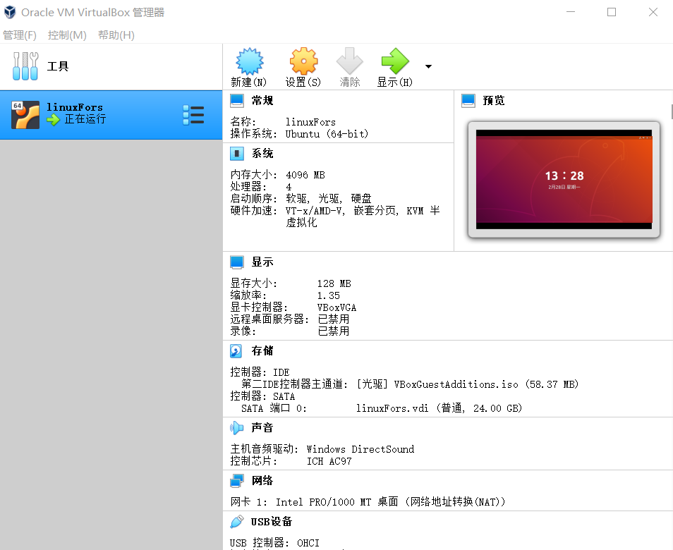

    找到清华相关下载源通过:
    > sudo gedit /etc/apt/sources.list

    指令更改下载源。之后通过更新后的下载源配置C/C++环境、nasm、qeum以及vscode。

- 新建文件lab1为实验单独下载linux内核5.10并编译成i386 32 位版本。
    > 编译内核操作:
    黑入内核将 Compile the kernel with debug info勾选
    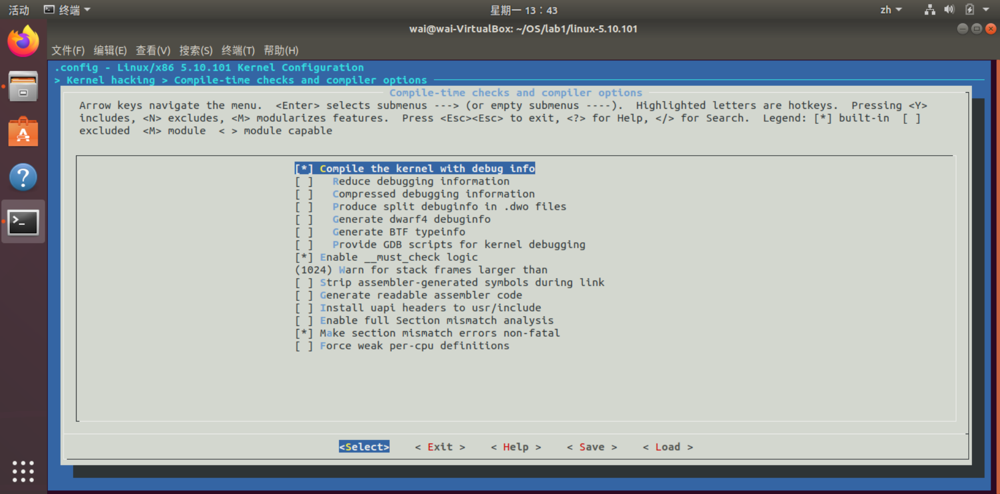
    目的是为了显示程序debug的时候的相关信息,将设置好的编译选项保存好输入make -j8进行编译
    压缩以及未压缩的内核映像均已准备好
    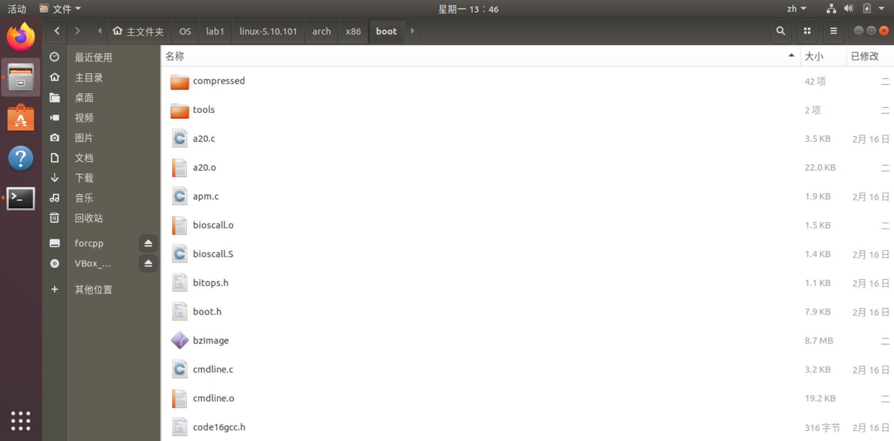
    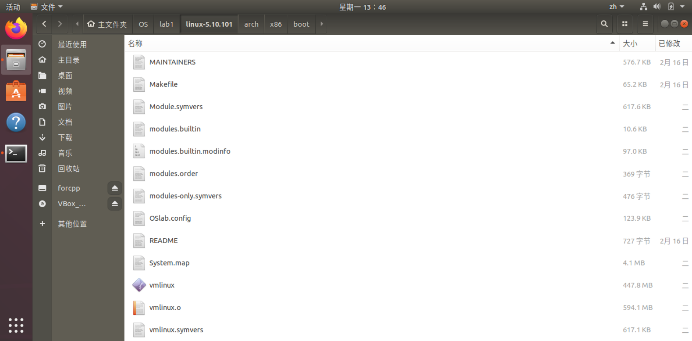

    因为qemu可以看作是一种虚拟机，可以模拟硬件，所以经由qemu和gdb测试无故障后进行下一步实验。
    > 内核无故障：
        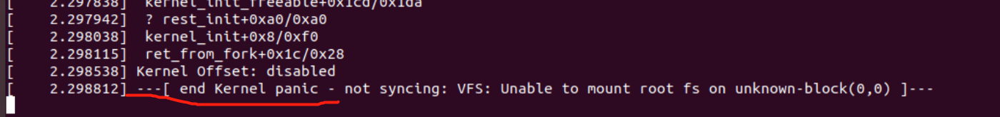

- 制作initramfs，先准备好将要压缩运行的文件，第一个文件为输出“helloworld”:
    >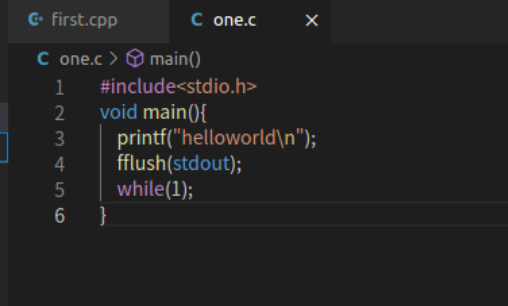
    其中while(1)为了使程序保持在用户态
  
  命名为helloworld，在其所在目录输入:
  >gcc -o helloworld -m32 -static helloworld.c
  **其中-m32是以32位编译的意思，-static是使程序与共享库断开(prevents linking with the shared libraries)**

    之后输入：
    > echo helloworld | cpio -o --format=newc > hw

    将程序以hw的名字用cpio打包，以上完成initramfs的制作，之后输入:
    > qemu-system-i386 -kernel linux-5.10.101/arch/x86/boot/bzImage -initrd hw -s -S -append "console=ttyS0 rdinit=helloworld" -nographic

    在qemu中运行，**其中-s 开启TCP端口，可以通过1234进行链接(open a gdbserver on TCP port 1234)，-S代表开始运行时不会使CPU开始运作，类似于设置初始断点，需要在gdb中输入c代表continue**
    之后新开终端启动gdb便可开始调试
    > 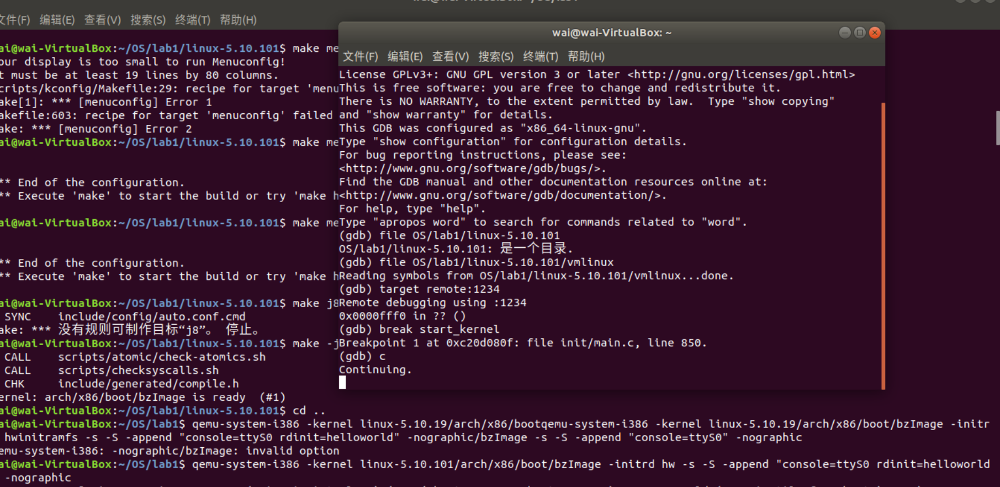
    在gdb调试前，打开的qemu是没有输出的，之后如图在gdb中输入信息在可得出结果，其中:
        1. file linux-5.10.101/vmlinux
        **代表打开符号表**
        1. target remote:1234
        **代表链接TCP端口**
        1. break start_kernel
        **代表在内核运作开始设置断点**
  
    结果如下：
  
    > 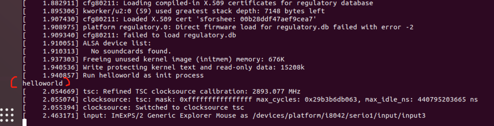
- **再一次使用qemu运行cpp程序：**
    > 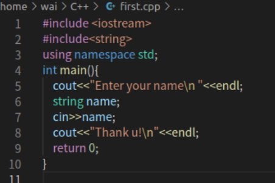
    提示输入字符串，输入后返回字符串

    因为程序过于简单便不再使用gdb调试，结果如下：
    
    > 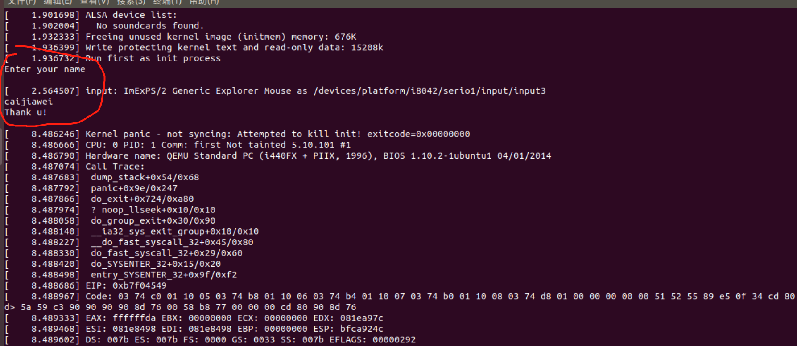
- 编译和启动busybox，先进入编译设置设置好32位i386cpu架构后保存编译安装busybox,将安装在_install目录下的文件和目录取出放在 ~/lab1/mybusybox 处。
    busybox可以看作linux的精简版本，制作其initramfs需要init程序，打开init文件输入以下内容并设置权限即可：
    > 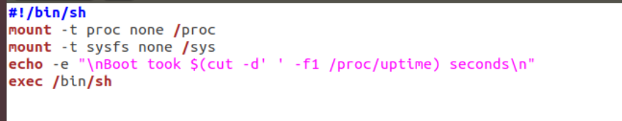

    输入：
    >find . -print0 | cpio --null -ov --format=newc | gzip -9 > ~/lab1/initramfs-busybox-x86.cpio.gz

    将x86-busybox打包压缩成cpio文件再同上述在qemu中打开hellworld文件加载busybox：
    > 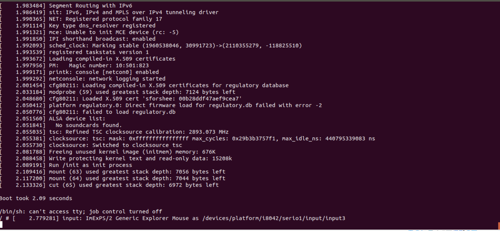

    输入ls查看文件夹：
    
    >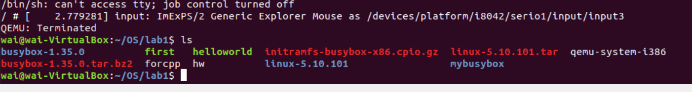
    
- **遭遇问题及解决：**
  在给c和cpp代码编译成可执行程序时，直接使用了vscode编译出来的exe，并且将其打包成cpio，导致程序在qemu中无法运行。曾一度以为是代码非法使用了库，调试许久。后来使用gcc以及g++重新编译运用控制变量法发现问题所在，**因为缺少-static**，程序与共享库动态链接导致程序打包后无法在qemu运行。
  

## 实验总结****

本次实验作为第一次实验，仅仅只是下载将来需要长期运作的实验环境，熟悉相应程序的运行以及调试。简单的实验，作为操作系统的入门确实对于让学生从0开始一直到能够编写出自己的简单的操作系统有不小的帮助，对于操作系统是控制和管理计算机的资源，合理调度计算机资源和工作、连接用户和其他软件与计算机硬件的软件等性质有了更进一步、更深入的了解，个人也感觉受益颇多。这也让我体会到，网络上相关的教程很多，相应程序的使用、优势、意义等说明也很多，但是大多晦涩难懂，在实验前看了许多网络上的教程相关，还是对实验一知半解，所以做实验最重要的还是自己动手实践，毕竟还有许多网络未有前人总结出来的东西还需要自己去发现。而且亲自动手实验也是能够给自己带来超乎意料的乐趣。
就基于本次实验，对于busybox以及qemu的使用都有了一些自己的理解，busybox作为“linux工具的瑞士军刀”，包含了许多linux的命令以及工具，个人认为可以将其作为临时建议的操作系统进行使用。qemu作为一种模拟硬件的强大的虚拟机，因为其开源，可移植，仿真速度快、可以在其他平台使用linux等特点，比起vm等其他虚拟机更适合在虚拟机上使用。
最后，斗胆提一些小小的建议，希望老师在整合网络上其他blog时可以注意一点细节，把一些该有的注释留下，不然有些部分对于从零开始的初学者而言是非常让人摸不着头脑的。

## 参考文献

> [Initramfs 原理和实践](https://www.cnblogs.com/wipan/p/9269505.html)
>[【Linux技术】BusyBox详解](https://www.cnblogs.com/lcw/p/3159388.html)
>[在qemu环境中用gdb调试Linux内核 ](https://www.cnblogs.com/wipan/p/9264979.html)